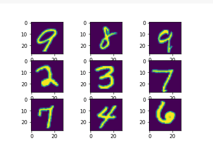
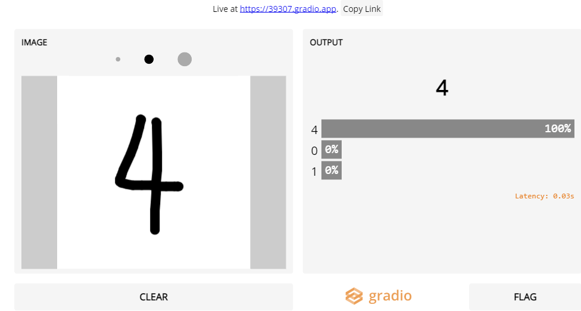
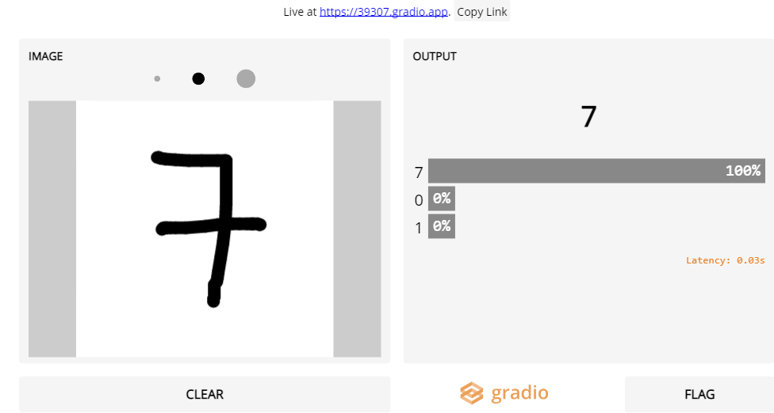
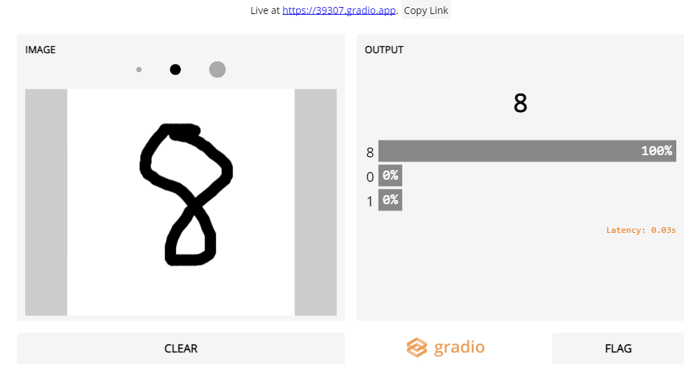

# MNIST_neural_network
Building your neural network using MNIST dataset is a great beginner project to work especially when you are new to neural networks
[Click here to view the notebook online](http://example.com)

# Additional Feature: 
-Sketchpad added where predicition of model deployed can be tested on the live

# Screenshots:

